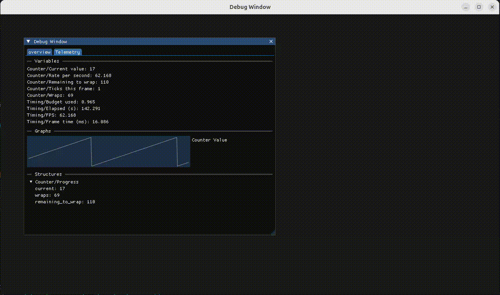

# ImGui Debug Visualizer

A lightweight Dear ImGui-based debug instrumentation library that can be embedded into any C++ application. It lets you register scalar values, live graphs, and hierarchical structures keyed by name, then renders them in a ready-to-use ImGui window so you can monitor and tune your systems in real time.



## Features

- Register scalar values (ints, floats, booleans, strings) keyed by name.
- Stream samples into time-series line graphs with automatic or manual scaling.
- Build hierarchical structures with a fluent builder API to visualize complex state.
- Organize your telemetry into tabs and spawn additional window tiles for subsystem-specific dashboards.
- Fire-and-forget API that feels like logging: call `dbgvis::value()` anywhere and a background thread takes care of rendering.
- Minimal dependencies for the data API, with built-in GLFW/OpenGL window management when you need it.

## Getting Started

### Prerequisites

- Bazel 6.0 or later.
- A C++17 toolchain.
- Internet access on the first build so Bazel can fetch Dear ImGui.

### Build the library and example

```bash
cd /home/buzz/Projects/ImGui_debug_visualizer
bazel build //debug_visualizer:debug_visualizer

# Interactive demo with GLFW + OpenGL renderer
bazel run //debug_visualizer:debug_visualizer_demo
```

The interactive demo spins up a GLFW window, loads OpenGL through GLEW, and renders the debug UI in real time—everything is encapsulated in the library so the example only updates values.

### Run the tests

```bash
bazel test //...
```

## Integrating into Your Project

1. Add this repository as a Bazel dependency (e.g., via `local_repository`).
2. Depend on `//debug_visualizer:debug_visualizer` from your `cc_binary` or `cc_library` targets.
3. Include `debug_visualizer/debug_visualizer.h` and start publishing values—no manual render loop required.

```cpp
#include <algorithm>
#include <chrono>
#include <cstdint>
#include <thread>
#include "debug_visualizer/debug_visualizer.h"

int main() {
    dbgvis::StartBackgroundVisualizer();         // optional: the first dbgvis::value() will start it automatically
    dbgvis::set_window_title("Debug Window");    // tweak the main window title once

    while (!dbgvis::IsBackgroundVisualizerRunning()) {
        std::this_thread::sleep_for(std::chrono::milliseconds(10));
    }

    constexpr int kMaxCounterValue = 255;
    constexpr int kCounterModulo = kMaxCounterValue + 1;

    auto start = std::chrono::steady_clock::now();
    auto last = start;

    int counter = 0;
    std::uint64_t wraps = 0;
    while (dbgvis::IsBackgroundVisualizerRunning()) {
        const auto now = std::chrono::steady_clock::now();
        const std::chrono::duration<float> elapsed = now - start;
        const std::chrono::duration<float> delta = now - last;
        last = now;

        const float delta_seconds = std::max(delta.count(), 1.0f / 240.0f);
        const int previous = counter;
        counter = (counter + 1) % kCounterModulo;
        if (counter == 0) {
            ++wraps;
        }

        const int ticks_this_frame = counter >= previous ? counter - previous : (counter + kCounterModulo) - previous;
        const int remaining = counter == 0 ? kMaxCounterValue : kMaxCounterValue - counter;

        dbgvis::value("Telemetry", "Counter/Current value", counter);
        dbgvis::value("Telemetry", "Counter/Wraps", static_cast<std::int64_t>(wraps));
        dbgvis::value("Telemetry", "Counter/Ticks this frame", ticks_this_frame);
        dbgvis::value("Telemetry", "Counter/Rate per second", ticks_this_frame / delta_seconds);
        dbgvis::value("Telemetry", "Counter/Remaining to wrap", remaining);
        dbgvis::value("Telemetry", "Timing/Elapsed (s)", elapsed.count());

        dbgvis::graph_sample("Telemetry", "Counter Value", static_cast<float>(counter));
        dbgvis::structure("Telemetry", "Counter/Progress", [counter, wraps, remaining](dbgvis::StructureBuilder& builder) {
            builder.field("current", counter);
            builder.field("wraps", static_cast<std::int64_t>(wraps));
            builder.field("remaining_to_wrap", remaining);
        });

        std::this_thread::sleep_for(std::chrono::milliseconds(16));
    }

    dbgvis::ShutdownBackgroundVisualizer();
}
```

Want more control? You can still instantiate `dbgvis::DebugVisualizerApp` yourself and call the low-level APIs exactly as before—the ergonomic helpers are layered on top of the same underlying types.

## Project Layout

- `debug_visualizer/` – Library headers, sources, and Bazel target.
- `tests/` – Lightweight regression tests covering core data flows.

## Next Steps

- Extend the graph API with multiple series per plot and annotations.
- Add persistence so you can record snapshots and compare frames.
- Experiment with additional renderer bindings (e.g., Vulkan, DirectX) by swapping the ImGui backend targets in the demo.

## License

The debug visualizer code is distributed under the GNU General Public License v3.0 (or later). Dear ImGui remains available under its original MIT license and is fetched directly from upstream.
